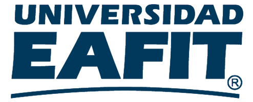
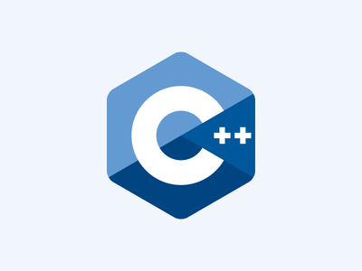

# Practica_operativos
# Interpretador paralelo de BINEWE 
   ### Sistemas Operativos
  
  # INTEGRANTES:

- **ALEJANDRO CORDOBA BODHERT**
- **CRAIG DAVID CARTAGENA CASTANO**

# PROFESOR:
- **JUAN FRANCISCO CARDONA MC'CORMICK**


# UNIVERSIDAD DE EAFIT

# INGENIERIA DE SISTEMAS

# 2018




# DESCRIPCION DEL PROYECTO
  
  Para el proyecto final de la materia de sistemas operativos de la universidad EAFIT 2018-1 nos proponen realizar un interpretador paralelo de BINEWE, aplicando el manejo de memoria y la concurrencia.

# TECNOLOGIAS
  
  

   - [C++](http://www.cplusplus.com): C++ es un lenguaje de programación diseñado a mediados de los años 1979 por Bjarne Stroustrup. La intención de su creación fue el extender al lenguaje de programación C mecanismos que permiten la manipulación de objetos.. 
   
   - [EWE](https://github.com/jfcmacro/ewe): Es un lenguaje para enseñanza.
   
   - [C++11](https://en.wikipedia.org/wiki/C%2B%2B11): C++11 es una versión del estándar del lenguaje de programación C++ aprobado por la Organización Internacional de Normalización (ISO) el 12 de agosto de 2011..

   - [Linux](https://es.wikipedia.org/wiki/GNU/Linux): GNU/Linux, también conocido como Linux, es un sistema operativo libre tipo Unix; multiplataforma, multiusuario y multitarea. El sistema es la combinación de varios proyectos, entre los cuales destacan GNU y el núcleo Linux.   
   

   
   ## EJECUCION
   
   se ejecuta con C++11
   

  ``` $ g++ -std=c++11 -o controlewe src/main.cpp src/controlewe.cpp src/interewe.cpp -lrt -lpthread ```


   

  
